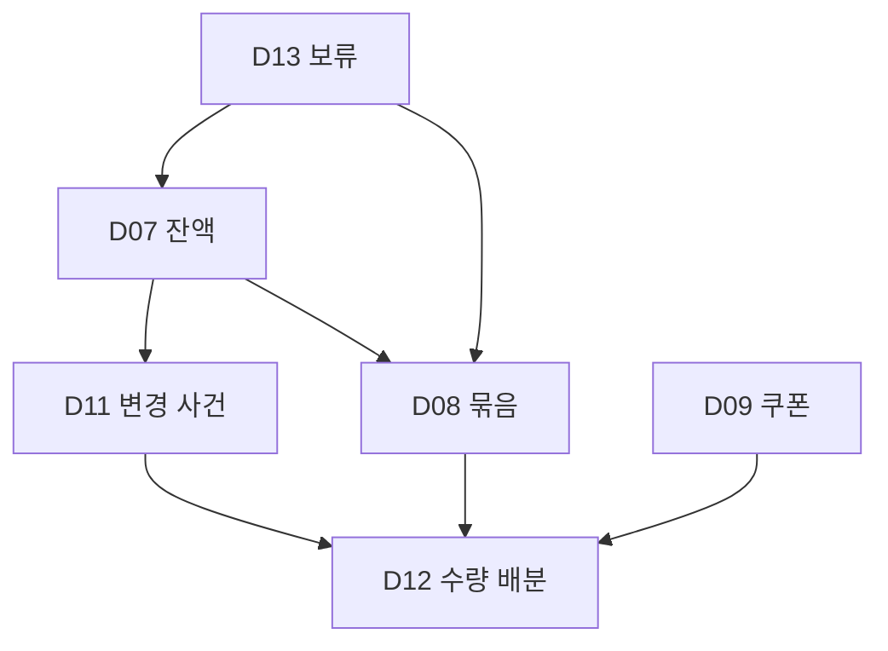

# 저장 항목·관계 — CupPick

> 문서: 06-data.md · 버전: 1.1 · 작성: 2026-09-15
> 기준: 01~04의 현재 MVP · 05-policy.md v1.1
> 상태: 논리 데이터 명세. SQL·실제 DB 생성·특정 서비스 선정은 수행하지 않음.

## 0. 저장 설계 원칙

여기서 한 항목은 저장할 **논리적 개체**다. 실제 테이블 개수와 같을 필요는 없다. 필드는 기능을 성립시키기 위한 정보만 정의한다. 화면 계산값·로컬 사본·운영 문서는 서버 원본과 구분한다.

- 단독 D번호는 이 파일의 D01~D22. 00-backlog.md의 위임결정 D번호는 `00-D01`처럼 문서명을 붙인다. 정책은 POL01~POL25다.
- ID는 이름과 무관한 고정 식별자. UUID/정수 등 물리형식은 구현에서 정하되 변경·병합으로 정체성을 잃지 않는다.
- 개인 데이터의 계정ID는 요청문자열을 그대로 신뢰하지 않고 인증된 소유자에서 검사한다. 자식행도 부모와같은계정이다.
- 모르는 수량/날짜/조건은 0·빈날짜·가능으로 바꾸지 않는다. 미확인 상태와값없음을함께 표현한다.
- 날짜는 한국 달력날짜, 사건 시각은 시간대 있는 절대시각으로 보관해 한국시간으로 표시한다. 입력/서버 기준 시각을구분한다.
- 캡처/OCR원문·공식비밀번호·결제·연속GPS·추천/리뷰·부분사용금액 필드를추가하지 않는다. 캡처 파일 자체는선택첨부로만 허용한다.

## 1. 공통 필드 그룹

### G1. 식별·접근·버전

변경 가능한 서버개체는 `id`, 개인 자료는 `account_id`, 생성/변경시각과`version`을 가진다. 자식의집합이함께바뀌는작업은부모버전도함께검사한다. 목록표시순서를ID로대체하지않고필요한순서값을별도로둔다. 동일값 확인도 확인 시점변경이므로 버전변경 대상으로 본다.

### G2. 날짜와 근거

| 필드 | 형식·규칙 |
| --- | --- |
| 날짜 신뢰 | 확인/예상/미확인/확인무기한 중 하나 |
| 현재 만료일 | 확인·예상이면 날짜, 미확인·무기한이면없음 |
| 적립/발급/기산일 | 실제 알려진 날짜만, 등록일과구분 |
| 정책ID·버전·계산 규칙 참조 | 예상계산에사용한고정버전. 사용자직접확인값은없을수있음 |
| 근거종류·확인 시각·근거설명 | 개인공식 확인/공통 정책/미확인. 캡처첨부는확인대체아님 |
| 시작일·시각/메뉴 조건 | 쿠폰일때선택. 시작일>만료일검사. 시·분자동 계산은없음 |

### G3. 생애·삭제·보류

쿠폰의생애, 휴지통항목참조, 묶음의현재 구성역할, 처리 보류는별개의필드/관계다. `사용가능=true` 하나로합치지않는다. 사용자화면의‘만료확인 필요’는보유+예상 날짜경과에서계산하며, 정리작업의실행여부는사건으로확인한다.

## 2. 저장 항목 목록

| ID | 항목 | 저장 위치 | 기능 | 정책 |
| --- | --- | --- | --- | --- |
| D01 | 사용자 계정 | 서버 인증/개인 저장 | F01·F04·F30 | POL02·POL22 |
| D02 | 계정별 기기·알림 수신 | 서버+기기 보호 저장 | F04·F26·F30·F31 | POL02·POL16·POL17·POL22 |
| D03 | 개인 화면 설정 | 계정 서버 설정/기기 화면 설정 | F02·F05·F06·F07 | POL03·POL04·POL05 |
| D04 | 브랜드·프로그램·잔액 분류 | 공통 서버 기준정보 | F03·F06·F08·F12·F15·F19·F22·F25·F34 | POL01·POL06·POL24 |
| D05 | 공통 정책 버전·근거 | 공통 서버 기준정보/운영 근거 | F12·F15·F22·F23·F34·F35 | POL09·POL11·POL14·POL24·POL25 |
| D06 | 지도 매장·지점 연결 | 공통 기준+공급 계약 허용 캐시 | F03·F05·F22·F24·F25·F34 | POL03·POL04·POL14·POL15·POL24 |
| D07 | 현재 스탬프 잔액 | 개인 서버 원본 | F06·F08·F09·F10·F11·F13·F14·F15·F16·F18·F28·F29 | POL06·POL07·POL08·POL10·POL11·POL12·POL18·POL19 |
| D08 | 스탬프 묶음·날짜 구성 | 개인 서버 원본 | F09·F11·F12·F13·F14·F15·F16·F18·F28·F29 | POL06·POL08·POL09·POL10·POL11·POL12·POL18·POL19 |
| D09 | 개별 쿠폰 | 개인 서버 원본 | F06·F12·F15·F17·F18·F19·F20·F21·F22·F25·F26·F27·F28·F29 | POL09·POL11·POL12·POL13·POL14·POL16·POL18·POL19 |
| D10 | 개인 매장 조건·확인 근거 | 개인 서버 원본 | F12·F22·F23·F24·F25 | POL09·POL14·POL15·POL24 |
| D11 | 변경 사건·정정 이력 | 개인 서버 원장/이력 | F10·F13·F14·F15·F18·F20·F27·F28·F29·F33 | POL07·POL10·POL11·POL12·POL13·POL18·POL19·POL23 |
| D12 | 전환·차감 배분 연결 | 개인 서버 원장 자식행 | F13·F14·F15·F17·F18·F29·F33 | POL06·POL10·POL11·POL12·POL19·POL23 |
| D13 | 처리 보류·해소 | 개인 서버 원본 | F11·F13·F15·F16·F23·F26·F34 | POL08·POL10·POL11·POL14·POL24 |
| D14 | 휴지통 항목·삭제 관계 | 개인 서버 원본/복원자료 | F21·F28·F29·F30 | POL18·POL19·POL20·POL22 |
| D15 | 첨부 파일·전송 상태 | 개인 서버 메타데이터+보호 파일저장 | F21·F28·F29·F30·F32 | POL18·POL19·POL20·POL21·POL22 |
| D16 | 기기별 임시 작성 | 기기 계정별 보호 저장만 | F04·F32·F33 | POL02·POL21·POL22·POL23 |
| D17 | 만료 예정·정리 안내 대상 | 개인 서버 예약/안내 근거 | F13·F20·F26·F33 | POL09·POL10·POL16·POL17·POL23 |
| D18 | 계정 하루 요약·기기 전달 | 개인 서버 요약+전달 자식행 | F26·F30·F33 | POL16·POL17·POL22·POL23 |
| D19 | 요청 중복·동시성 처리 근거 | 서버 기술 저장 | F13·F14·F15·F18·F29·F33 | POL10·POL11·POL12·POL19·POL23 |
| D20 | 오프라인 사본·탐색 응답 | 기기 보호 저장/계약 허용 단기캐시 | F01·F02·F03·F05·F06·F25·F31 | POL03·POL04·POL05·POL15·POL22·POL24 |
| D21 | 삭제 실행·백업 제외 근거 | 서버 운영 최소 기록 | F29·F30·F34 | POL18·POL19·POL22·POL24 |
| D22 | 운영 기본값·정책 검증·파일럿 결과 | 배포설정+운영 문서; 사용자 앱 DB 필수 아님 | F34·F35 | POL24·POL25 |

## 3. 항목별 칸·제약·수명

### D01. 사용자 계정

저장: 서버 인증/개인 저장 · 정책: POL02·POL22

| 칸 | 형식·필수 여부 | 규칙·예시 |
| --- | --- | --- |
| 계정ID | 고정 ID·필수 | 개인 데이터 소유자. 다른 제공자는 다른계정 |
| 로그인 제공자·제공자 사용자ID | 열거+식별자·필수 | 구글/네이버/카카오와 해당 subject 조합 고유. 이메일을 병합키로 쓰지 않음 |
| 계정 상태·가입시각 | 활성/탈퇴처리중+시각·필수 | 탈퇴 확정 시 즉시 접근 차단 |
| 탈퇴 요청·운영삭제 기한 | 시각·탈퇴 시 필수 | 요청+24시간. 삭제완료 상태는D21로 최소 추적 |

수명·경계: 계정 유지 중 보관. 탈퇴 후 운영데이터 24시간, 백업 30일. 공식 브랜드 앱 비밀번호·결제카드·불필요한 프로필은 저장하지 않는다.

### D02. 계정별 기기·알림 수신

저장: 서버+기기 보호 저장 · 정책: POL02·POL16·POL17·POL22

| 칸 | 형식·필수 여부 | 규칙·예시 |
| --- | --- | --- |
| 기기설치ID·계정ID | 고정 ID+참조·필수 | 기기와 로그인 계정의 연결. 계정 변경 시 이전 수신연결 해제 |
| 알림 수신선택·권한 상태 | 참/거짓+허용/거부/미결정 | 사용자선택과OS권한은 별도 |
| 푸시 전달 토큰/안전한 참조 | 민감 문자열·발송가능 때 | 유효 로그인·수신허용일 때만 사용, 로그아웃/탈퇴 시 연결폐기 |
| 마지막 온라인인증·접근 종료 | 시각·필수/종료 시 | 7일 오프라인 허용과 종료검사에 사용. 기기시각만 신뢰해 인증을 연장하지 않음 |

수명·경계: 로그아웃 시 인증·발송연결 폐기. 계정에 남은 최소기기상태도 탈퇴수명 적용. 인증 토큰은 선택한 인증체계의 보호 저장소로 관리하고 일반 혜택 필드에 넣지 않는다.

### D03. 개인 화면 설정

저장: 계정 서버 설정/기기 화면 설정 · 정책: POL03·POL04·POL05

| 칸 | 형식·필수 여부 | 규칙·예시 |
| --- | --- | --- |
| 계정ID·마지막 혜택 정렬 | 참조+만료임박/선호순 | 최초 기본은 만료임박 |
| 선호 브랜드 순서 | 브랜드ID 순서목록·선택 | 중복 없는 순서. 빈목록 허용 |
| 외부 지도 기본선택 | 지원지도 식별자·선택 | 기기 설정. 미설치/지원변경 시 대안 안내 |
| 마지막 조회 위치·기준·화면 | 좌표/지역표시+현재/지정+복원상태·선택 | 기기 로컬에 마지막 한 상태만. 연속 위치이력 아님 |

수명·경계: 개인설정은 계정 수명. 마지막 위치·화면은 기기 복원 목적, 다른계정에 개인 기준이 노출되지 않게 분리한다. 위치 이동이력을 서버에 누적하지 않는다.

### D04. 브랜드·프로그램·잔액 분류

저장: 공통 서버 기준정보 · 정책: POL01·POL06·POL24

| 칸 | 형식·필수 여부 | 규칙·예시 |
| --- | --- | --- |
| 브랜드ID·표시이름 | ID+문자열·필수 | 대상 13개. 예: 매머드 |
| 프로그램ID·상위브랜드ID·이름 | ID+참조+문자열·필수 | 예: 매머드커피/매머드익스프레스. 같은 브랜드 안 별도 프로그램 |
| 용도·적립범위 선택정의 | 분류값·검증된 경우 | 교환용/승급용 등, 공통/지점. 실제 정책 확인 없이 자동적용 금지 |
| 기준정보 상태·근거정책ID | 확인/미확인/보류+참조 | 미확인 브랜드도 수동기록은 허용 |

수명·경계: 활성 서비스 기준정보로 보관. 이름변경은ID 변경이 아니며, 기존개인 기록 참조를 유지한다. 특정 브랜드의 실제 교환수치 예시를 자동 규칙으로 넣지 않는다.

### D05. 공통 정책 버전·근거

저장: 공통 서버 기준정보/운영 근거 · 정책: POL09·POL11·POL14·POL24·POL25

| 칸 | 형식·필수 여부 | 규칙·예시 |
| --- | --- | --- |
| 정책ID·버전·대상 | ID+버전+브랜드/프로그램/용도/쿠폰종류 | 적용 범위가 명시돼야 자동 계산 가능 |
| 공식 원문·시행기간·확인일·검토담당 | URL/근거참조+날짜/시각+담당참조 | 출처와 적용 시점/검토시점을 분리 |
| 계산·교환·순서 규칙 | 구조화 규칙·확인된 부분만 | 기산일종류·일/월단위·개수·포함일·월말/윤년·교환수량/선택방식·차감순서. 불명확은값없음 |
| 매장 공통/예외 규칙·완전성 | 조건+목록참조+완전/부분/미확인 | 적립과사용의 대상 구분 |
| 검토상태·중지사유·재확인일 | 활성/미확인/중지+문자열/시각 | 90일재확인없음 보류 및 오류 중지 |
| 검증사례·결과 참조 | 운영 자료 참조 | 사례 작성과 실행 결과 구분 |

수명·경계: 기존 개인 기록 계산 근거가 필요한 버전은 연결 보존. 새버전으로 과거개인값을 덮어쓰지 않는다. 브랜드별 약관 원문은 검증 전 비워둔다.

### D06. 지도 매장·지점 연결

저장: 공통 기준+공급 계약 허용 캐시 · 정책: POL03·POL04·POL14·POL15·POL24

| 칸 | 형식·필수 여부 | 규칙·예시 |
| --- | --- | --- |
| 내부매장ID·공급자·장소ID | ID+문자열+ID | 공급자별 장소ID 고유, 이름은 식별키 아님 |
| 브랜드·프로그램 연결 | 참조·확인된 범위 | 프로그램 미확인은 추정 연결하지 않음 |
| 매장명·주소·좌표 | 문자열+좌표 | 캐시/표시는 계약 허용범위. 위도-90~90·경도-180~180 |
| 매장 정보 상태·출처·조회 시점 | 정상/폐점확인/정보확인 필요+근거+시각 | 검색실패를 폐점으로 바꾸지 않음 |
| 이전 연결·재연결 근거 | 이전ID+근거·변경 시 | 주소·좌표 등으로 같은 지점임을 확인하고 개인 조건 연결 변경 |

수명·경계: 외부지도 데이터 캐시기간은 공급 계약을 넘기지 않는다. 개인혜택 연결에 필요한 내부ID는 유지하되 폐점으로 혜택 삭제 금지. 새지점에 자동으로 개인 조건 승계 금지.

### D07. 현재 스탬프 잔액

저장: 개인 서버 원본 · 정책: POL06·POL07·POL08·POL10·POL11·POL12·POL18·POL19

| 칸 | 형식·필수 여부 | 규칙·예시 |
| --- | --- | --- |
| 잔액ID·계정ID | ID+소유자·필수 | 버전 검사 단위, 공식 적립계정 실시간값 아님 |
| 브랜드·프로그램·용도·적립범위/지점 | 참조/열거·아는 부분 | 알려진 활성단위 고유. 모르는 분류는 별도 미확인식별자 |
| 미확인 구분ID | ID·구분 모를 때 | NULL끼리 같은 잔액으로 합치지 않도록 구별 |
| 현재 기록수량 | 정수≥0·필수 | 공식 현재 값 맞추기 또는 사건 반영 결과 |
| 공식 확인수량·확인 시점 | 정수≥0+시각·확인 시 | 현재 값과 다를 수 있음. 자동 정리는 현재 값만 바꿈 |
| 구성 확인 상태·구성 확인 시점 | 유효/확인 필요+시각·선택 | 숫자 확인으로 갱신하지 않음 |
| 휴지통참조·현재 버전 | 참조·선택+버전·필수 | 다른잔액/발급쿠폰 삭제로 전파하지 않음 |

수명·경계: 활성은 계정유지. 등록삭제는 60일휴지통. 현재수량을 일반 이력 365일 규칙으로 없애지 않는다. 구성미확인수량은현재 값−유효묶음합에서 계산한다.

### D08. 스탬프 묶음·날짜 구성

저장: 개인 서버 원본 · 정책: POL06·POL08·POL09·POL10·POL11·POL12·POL18·POL19

| 칸 | 형식·필수 여부 | 규칙·예시 |
| --- | --- | --- |
| 묶음ID·잔액ID·소유자 | ID+참조·필수 | 날짜/매장 속성이 같은 수량을 한 번만 나타냄 |
| 남은수량·역사수량 | 정수≥0·현재/과거 구분 | 사용/만료된 수량을 활성 합계에 다시 넣지 않음 |
| 적립일·필요한 적립매장 | 날짜/참조·선택 | 모르면값없음. 모든 과거이력 입력 필수 아님 |
| 만료 날짜그룹 | 아래 공통G2 | 확인/예상/미확인/무기한, 정책·기산일·확인근거 |
| 구성 역할·원 사건 연결 | 유효 현재/보류 과거/소진 이력+참조 | 보류 과거는현재 합계 제외. 유효수량이어도 별도 전환보류가 있을 수 있음 |
| 휴지통·버전 | 참조+버전 | 부모 삭제와독립만료 정보삭제 구분 |

수명·경계: 유효 현재는잔액수명, 소진/변경 이력은 365일, 사용자 삭제 60일. 원 사건 재구성 근거가 사라지면 자동 복구 대신 공식 잔액 확인.

### D09. 개별 쿠폰

저장: 개인 서버 원본 · 정책: POL09·POL11·POL12·POL13·POL14·POL16·POL18·POL19

| 칸 | 형식·필수 여부 | 규칙·예시 |
| --- | --- | --- |
| 쿠폰ID·계정ID·브랜드ID | ID+참조·필수 | 복수 발급도 장마다 별도ID |
| 이름/혜택 설명·쿠폰종류 | 문자열·필수+스탬프/행사기타/모름 | 최소 식별설명. 프로그램은 아는 경우 연결 |
| 발급일·사용시작일·조건문구 | 날짜/문자열·선택 | 등록일≠발급일. 메뉴·주문·정밀시각 조건은 보조문구 |
| 만료 날짜그룹 | 공통G2 | 실제 만료는신뢰상태와함께 저장 |
| 생애·사용/만료/취소 사건참조 | 보유/사용 완료/만료/전환 취소+참조 | 휴지통과별개. 날짜 수정만으로 생애 되돌리지 않음 |
| 전환그룹/개별연결·버전·휴지통 | 참조·선택+버전 | 독립등록은전환연결없음. 삭제는원스탬프가산 아님 |

수명·경계: 보유는 계정 수명. 사용/만료/전환 취소 이력은 365일, 사용자 삭제는 60일. 금액권잔액·부분사용·실제바코드사용 기능 필드는 만들지 않는다.

### D10. 개인 매장 조건·확인 근거

저장: 개인 서버 원본 · 정책: POL09·POL14·POL15·POL24

| 칸 | 형식·필수 여부 | 규칙·예시 |
| --- | --- | --- |
| 조건ID·계정ID·대상 종류/ID | ID+참조·필수 | 쿠폰사용/잔액적립 목적과대상을 고정 |
| 입력경로·목록완전성 | 공통/지정/미확인+전체/일부/미확인 | 전체확인 없이목록밖불가 금지 |
| 매장항목 목록 | 자식행: 매장참조 또는 직접입력이름·주소 | 미연결이름은지도매장 조건 확정에 사용하지 않음 |
| 항목판정·근거종류·확인 시점 | 가능/불가/미확인+개인/공식/없음+시각 | 개별 쿠폰에서확인한근거는계정·쿠폰에 한정 |
| 정책 버전·조건설명·예외확인 | 참조·선택+문자열/참거짓 | 공통 정책의 적용 범위·예외완전성 근거 |
| 충돌상태·상대근거 참조 | 해소/확인 필요+참조 | 관련조건만판정보류, 다른상태를덮어쓰지 않음 |

수명·경계: 부모 수명과동일. 일부목록의 바깥 모든 매장을불가행으로 저장하지 않는다. 공통 정책과개인 확인 기록을별도 보관하고표시판정은 조합계산한다.

### D11. 변경 사건·정정 이력

저장: 개인 서버 원장/이력 · 정책: POL07·POL10·POL11·POL12·POL13·POL18·POL19·POL23

| 칸 | 형식·필수 여부 | 규칙·예시 |
| --- | --- | --- |
| 사건ID·계정ID·요청ID | ID+참조·필수 | 한 번 반영을 확인하는근거 |
| 사건종류·대상·발생시각 | 추가/잔액 맞춤/확인/만료/전환/사용/취소/복구/삭제/복원+참조+시각 | 공식실제행위 시각과기록 시각이 다르면구분 |
| 잔액 변화량·처리 전후수량·대상 버전 | 정수/정수≥0/버전·수량사건 때 | 내역삭제/확인은 변화량 0. 자동현재 값갱신과공식 확인 갱신분리 |
| 원 사건·정정 사건·반영방법 | 참조+직접반영/현재 잔액에이미반영/현재 잔액 맞춤 | 차감반영 없는 전환 확인도 구별 |
| 복원에 필요한 이전값·사용자설명 | 제한된값/문자열·필요 시 | 수량·원 날짜·생애. 전체불필요개인스냅샷은 저장하지 않음 |
| 목록삭제·이력기한·최소 근거 상태 | 휴지통참조+시각+일반/최소 | 설명/이미지삭제가개수복구를유발하지 않음 |

수명·경계: 일반 365일/삭제 60일. 활성 연결에 필요한ID·수량·처리 완료만 최소보존, 정리된이름/설명/이미지는삭제. 근거부족은복구추정 금지.

### D12. 전환·차감 배분 연결

저장: 개인 서버 원장 자식행 · 정책: POL06·POL10·POL11·POL12·POL19·POL23

| 칸 | 형식·필수 여부 | 규칙·예시 |
| --- | --- | --- |
| 배분ID·계정ID·전환그룹ID | ID+참조 | 한 거래의복수쿠폰 그룹과개별배분 구분 |
| 원 사건ID·잔액ID·쿠폰ID | 참조·전환쿠폰일 때쿠폰 필수 | 한 쿠폰에여러묶음, 한 묶음에여러쿠폰의배분 가능 |
| 묶음ID·배분수량 | 참조·모르면없음+정수>0·알 때 | 구성 모름에가짜묶음/0개를넣지 않음. 미상은따로표시 |
| 배분확실성·반영경로 | 확인/미확인+실제차감/이미현재 잔액반영/정합성맞춤 | 확정합계만차감/취소계산. 불명확시공식 잔액 |
| 원 날짜/구성 근거·이미복구 수량 | 참조/제한스냅샷+정수≥0 | 복구 수량≤확인배분수량. 만료수량을활성에더하지 않음 |

수명·경계: 관련활성·휴지통·보류연결을위한최소 수량근거보존. 원 날짜/구성이소실되면 자동 복구하지 않음. 독립쿠폰삭제로이연결을차감취소하지 않는다.

### D13. 처리 보류·해소

저장: 개인 서버 원본 · 정책: POL08·POL10·POL11·POL14·POL24

| 칸 | 형식·필수 여부 | 규칙·예시 |
| --- | --- | --- |
| 보류ID·계정ID·잔액/묶음/조건 참조 | ID+참조 | 사유별로독립 기록. 전체 계정보류로확대하지 않음 |
| 사유·영향범위 | 구성 불명/전환 확인/정책충돌+특정/기존영향가능전체 | 범위를구체ID목록이나당시대상 버전으로고정. 나중에생긴무관묶음까지자동포함 금지 |
| 시작시각·관련정책/전환사건 | 시각+참조·선택 | 구성보류와전환보류를구분 |
| 해소시각·해소근거·해소사건 | 시각/참조·해소 시 | 숫자확인만으로해소 금지. 모든유효보류가없어야재개 |

수명·경계: 미해소는활성근거. 해소이력은일반 이력규칙이며부모 삭제/탈퇴와같이정리한다. 상세범위모름은논리적으로보수적범위를표시한다.

### D14. 휴지통 항목·삭제 관계

저장: 개인 서버 원본/복원자료 · 정책: POL18·POL19·POL20·POL22

| 칸 | 형식·필수 여부 | 규칙·예시 |
| --- | --- | --- |
| 삭제항목ID·계정ID·대상종류/ID | ID+참조·필수 | 내역/만료 정보/잔액/쿠폰/첨부 구분 |
| 삭제시각·복원기한·원부모 삭제ID | 시각+시각+참조·부모연동 때 | 삭제+60×24시간, 독립 삭제는별도관계 |
| 복원용 이전상태/만료 정보 | 제한스냅샷·필요 시 | 이미지복사아닌D15참조. 활성 합계와별개 |
| 복원/영구 삭제 처리시각·요청ID | 시각+참조 | 기한내성공 1회. 복원과자동삭제경쟁은버전 검사 |

수명·경계: 부모영구 삭제 종속첨부도 제거. 휴지통 복원은수량연산 자체가 아니다. 영구 삭제 후최소중복방지근거는D11/D19, 본문/이미지는남기지 않는다.

### D15. 첨부 파일·전송 상태

저장: 개인 서버 메타데이터+보호 파일저장 · 정책: POL18·POL19·POL20·POL21·POL22

| 칸 | 형식·필수 여부 | 규칙·예시 |
| --- | --- | --- |
| 첨부ID·계정ID·부모종류/ID | ID+참조·연결완료 시 | 부모와같은계정, 하나의활성 연결. 중복파일이어도소유권공유 금지 |
| 저장객체 참조·형식·바이트수 | 보호 참조+MIME+정수 | 영구공개URL 저장안함.3장/10MB/총 300MB검사 |
| 전송작업ID·상태 | ID+아래 필수 확장의 D15 상태 | 부모저장과연결완료 확인전성공표시 금지 |
| 삭제관계·교체전첨부ID | D14참조+선택참조 | 교체전파일도휴지통용량산입 |

수명·경계: 부모 수명/사용자 삭제 기본 60일/선택 영구 삭제 POL20/탈퇴 24시간·백업 30일. 로컬 초안첨부는D16으로서버미전송. 임시업로드의정리와본문사진의 60일휴지통을혼동하지 않는다.

### D16. 기기별 임시 작성

저장: 기기 계정별 보호 저장만 · 정책: POL02·POL21·POL22·POL23

| 칸 | 형식·필수 여부 | 규칙·예시 |
| --- | --- | --- |
| 초안ID·계정ID·작업ID·대상ID | ID+참조·기존수정만대상 필수 | 기존대상당 1개·신규작업당 1개 |
| 기준서버 버전·기준상태 | 버전+생애/휴지통·기존수정 때 | 최신대상과충돌확인 |
| 작성값·로컬첨부참조 | 해당폼필드+참조 | 확정D07/D09에미반영. 아직유효하지않은입력도초안은유지가능 |
| 마지막편집·만료·총첨부바이트 | 시각+시각+정수 | 30일·20건·100MB/기기·계정,7일전안내 |

수명·경계: 저장 성공/버리기/기한만료 시 삭제. 로그아웃 기본유지·같은계정재인증. 다른기기동기화없음·일반기기 백업제외.

### D17. 만료 예정·정리 안내 대상

저장: 개인 서버 예약/안내 근거 · 정책: POL09·POL10·POL16·POL17·POL23

| 칸 | 형식·필수 여부 | 규칙·예시 |
| --- | --- | --- |
| 예약ID·계정ID·혜택종류/ID | ID+참조 | 묶음과쿠폰 구분 |
| 예약종류·한국예정일·대상날짜버전 | D-3/당일/정리 결과+날짜+버전 | 날짜/상태 변경 때기존예약무효화 |
| 신뢰/정리사건 참조·예약상태 | 확인/예상 또는사건ID+대기/취소/포함완료 | 예정과정리 결과는판정조건별개 |
| 포함된 요약ID | 참조·완료 시 | 정리 결과의다음 날중복포함 방지 |

수명·경계: 활성예약은미래일정만. 취소/포함완료는중복방지에필요한최소참조를보존하고일반 이력수명 적용. 원자료삭제시본문복제보존금지.

### D18. 계정 하루 요약·기기 전달

저장: 개인 서버 요약+전달 자식행 · 정책: POL16·POL17·POL22·POL23

| 칸 | 형식·필수 여부 | 규칙·예시 |
| --- | --- | --- |
| 요약ID·계정ID·한국 날짜 | ID+참조+날짜·고유조합 | 계정당 하루 1개 |
| 포함 대상참조·안내종류·생성/확인 시각 | D17참조목록+예정/정리+시각 | 단일/복수진입, 확인상태는계정동기화 |
| 기기전달 행 | 요약ID+기기ID 고유 | 수신허용/로그인재검사 |
| 전달 상태·시도시각·제공자 응답참조 | 대기/성공/실패/결과 불명+시각+참조 | 결과 불명을 성공으로 간주하지 않음. POL17 조건을 만족하는 재시도만 동일 발송 키 사용 |

수명·경계: 일반안내이력 365일 범주로관리. 삭제한혜택의이름/본문을요약스냅샷에계속보존하지 않음. 기술응답은필요한오류 분류/참조만, 푸시 토큰복제금지.

### D19. 요청 중복·동시성 처리 근거

저장: 서버 기술 저장 · 정책: POL10·POL11·POL12·POL19·POL23

| 칸 | 형식·필수 여부 | 규칙·예시 |
| --- | --- | --- |
| 계정ID·요청ID·대상/기대버전 | 참조+ID+버전·필수 | 동일계정요청ID고유. 자동작업도고정처리키 |
| 요청 내용 지문 | 해시/동등한비교근거 | 같은요청ID 다른내용 거부, 불필요한전체개인 본문 저장금지 |
| 처리상태·결과사건/결과버전 | 처리중/성공/실패/결과확인 필요+참조 | 결과 불명재시도는기존사건조회 |
| 성공 반영시각·완료참조 | 시각+참조 | 중복차감/복구방지. 고객에게내부락노출필요없음 |

수명·경계: 활성/휴지통/보류에연결된중복방지기간동안최소유지, 이후일반기술정리. 탈퇴데이터 수명우선. 상세TTL/물리락방식은구현 명세지만기존사건중복처리방지를깨면안됨.

### D20. 오프라인 사본·탐색 응답

저장: 기기 보호 저장/계약 허용 단기캐시 · 정책: POL03·POL04·POL05·POL15·POL22·POL24

| 칸 | 형식·필수 여부 | 규칙·예시 |
| --- | --- | --- |
| 사본계정·마지막인증/조회·서버 버전 | 참조+시각+버전 | 7일조회접근과오래된값표시 |
| 혜택 마지막 조회값 | 필요한D07/D08/D09/D10 사본 | 원본아님·오프라인저장불가. 계정전환시폐기 |
| 탐색기준·응답후보·도보응답 | 좌표/범위+장소참조+미터/초/출처/조회시각 | 공급 계약허용캐시만. 도보실패는값없음,0으로대체 금지 |
| 페이지/검색상태 | 커서+성공/없음/실패/일부 | 미조회전체를없음으로표시하지 않음 |

수명·경계: 조회 사본은로그아웃폐기·인증 7일기한접근제한. 도보/지도캐시의구체수명은공급 계약에종속. 연속GPS·방문이력·경로선저장목적없음.

### D21. 삭제 실행·백업 제외 근거

저장: 서버 운영 최소 기록 · 정책: POL18·POL19·POL22·POL24

| 칸 | 형식·필수 여부 | 규칙·예시 |
| --- | --- | --- |
| 삭제작업ID·대상참조·삭제종류 | ID+최소참조+기한정리/탈퇴 | 원문/이미지복제 아님 |
| 접근 차단·운영삭제·백업최종기한/완료 | 시각+처리상태 | 탈퇴즉시차단/24시간/30일 확인 |
| 삭제된 대상의 재복원 차단목록 | 최소식별자+적용시각 | 백업 복원에서삭제대상이돌아오지않도록재적용 |
| 기기 사본 제거 확인 | 기기참조+재연결확인 시각·가능한 경우 | 미연결 기기즉시삭제완료로기록금지 |

수명·경계: 마지막관련백업제거·검증 완료까지만필요한최소참조, 이후정리. 탈퇴자의프로필/혜택본문을삭제로그명목으로남기지 않는다.

### D22. 운영 기본값·정책 검증·파일럿 결과

저장: 배포설정+운영 문서; 사용자 앱 DB 필수 아님 · 정책: POL24·POL25

| 칸 | 형식·필수 여부 | 규칙·예시 |
| --- | --- | --- |
| 설정버전·적용일·한도값·변경 근거 | 버전/시각/수치/00참조 | 같은설정으로클라이언트/서버경계검사. 사용자원요구/위임기본값 구분 |
| 공급 계약·조회 한도·비용 상한·경보 | 운영참조+수치 | 80%경보, 상한 도달신규유료조회중지. 실제값은계약검증뒤입력 |
| 검증 항목·담당·실행 결과/근거 | 문서행 | 계획/실행완료/실패 구분. 자동 수집대시보드추가없음 |
| 파일럿 기간·표본·과제결과·중대오류 | 운영집계/문서 | 분모·이탈·완료율·중앙시간·2주차이용·도움응답·알림대상수를근거와함께 기록 |

수명·경계: 개인쿠폰원문·위치이력을분석목적으로추가수집하지 않는다. 파일럿은필요집계/과제기록만. 공급자계약비밀·API키는일반문서/사용자DB에노출하지 않는다.

### 기존 저장 항목의 필수 확장

| 항목 | 추가 필드·규칙 |
| --- | --- |
| D07 | 숫자 확인은 공식 확인 수량+확인 시각+확인 사건을 함께 저장. 8→자동 6→같음 확인은 공식 확인도 6. 최신 확인 표시를 과거 사건으로 후퇴시키지 않음 |
| D08 | 분할 부모ID·분할 사건ID·원 계보ID·구성 역할에 분할 이력 추가. 분할 직전 남은 수량=자식 초기 수량합. 원 묶음은 현재 합계에서 제외. 날짜/근거는 자식에 승계 |
| D08 | 만료 주기ID·현재 주기 처리 상태(미처리/차감 완료/복구 후 종료). 일반 수정 버전과 독립. 분할 자식은 원 주기 계보를 참조하며 부모는 처리 대상에서 제외 |
| D09 | 전환 연결 사건ID 선택. 독립 쿠폰 후속 연결 시 기존 ID/생애 유지. 하나의 쿠폰은 하나의 전환 소속, 같은 전환의 복수 배분은 허용 |
| D11 | 숫자 확인 사건의 확인 수량·실제 확인 시각, 분할/후속 연결/만료 복구 사건종류. 반영 완료 근거가 되는 잔액 확인 사건ID |
| D12 | 원 배분을 덮어쓰지 않음. 분할 이후 신규 배분은 현재 자식ID 참조. 새 복구 수량은 원 배분의 차감량−기존 누적 복구량 이하로 제한. 기존 쿠폰 연결도 동일 배분 모델 |
| D13 | 사유가 걸린 구체 자식 묶음 목록. 일부 중첩은 먼저 분할. 같은 자식에 복수 사유 허용하며 합계는 서로 다른 대상 수량만 한 번 계산 |
| D14 | 부모 복원 시 미선택 사진은 독립 항목으로 바꾸되 삭제/만료 시각 유지. 사진 영구 삭제 중에는 복원 차단 |
| D15 | 업로드 예약 바이트·예약 만료시각·부모 연결 버전·영구 삭제 요청/완료시각. 상태는 예약/업로드 완료 미연결/활성/휴지통/삭제 처리 중/삭제 실패/삭제 완료 |
| D17 | 사건에 연결된 알림 변경 의도, 예정시각·처리상태·시도 횟수·다음 시각·오류 분류. 외부 큐 반영 완료와 의도 저장을 구분 |
| D18 | 제공자 발송 키·접수 조회 결과·재시도 횟수·종료기한·중복 제거 지원 근거 참조. 실제 OS 수신 여부와 서버 접수 성공을 구분 |
| D19 | 사용자 요청ID 또는 자동 키(묶음ID+만료 주기ID). 일반 편집 버전은 동시성 검사에만 사용. 결과 상태와 연결 사건은 동일 저장 단위 |
| D21 | 사진 실제 삭제 작업과 백업 복원 차단 식별자. 삭제 성공 후 용량 반환 1회, 최소 차단 식별자 최대 30일. 삭제 성공의 작업 식별자는 용량 반환 완료까지 유지하되 파일 본문은 보존하지 않음. 본문·사진은 포함하지 않음 |
| D22 | 품질 시험 환경/측정 결과, 제공자 선정 근거/비용 상한/캐시 TTL, 최소 OS 버전, 운영 담당자, 출시 게이트 상태와 확인일 |

기존 D08 구성 역할의 유효 현재/보류 과거/소진 이력에 분할 이력을 추가한다. 분할은 적립·만료·복구 사건이 아니므로 잔액 변동량 0이다. 미확인 수량을 임의 묶음으로 만들지는 않는다.

## 4. 핵심 관계

화살표는 연결 관계이며 자동 삭제 전파를 뜻하지 않는다. 특히 잔액 삭제가 이미 발급된 쿠폰 삭제로 이어져서는 안 된다.

| 관계 | 수량·참조 규칙 |
| --- | --- |
| D01 계정→개인개체 | 한 계정에여러잔액·쿠폰·조건·사건. 모든자식소유권 일치 |
| D04 브랜드→프로그램→D07 잔액 | 브랜드안여러프로그램/용도/지점. 활성식별 단위고유, 미확인별도 |
| D07 잔액→D08 묶음 | 0개이상. 유효묶음합≤현재 잔액, 과거참고묶음합산금지 |
| D11 사건↔D08/D09 | D12로묶음별·쿠폰별수량연결. 원 사건정정은추가사건으로추적 |
| D13 보류→잔액/묶음/조건 | 복수사유허용, 대상범위고정, 모든해소전처리재개금지 |
| D10 조건→잔액또는쿠폰 | 적립/사용목적과대상한개. 매장자식목록/개인근거별도 |
| D14 휴지통→원대상/부모 삭제 | 원생애와독립. 부모 복원으로독립 삭제첨부가살아나지않음 |
| D17 예정/결과→D18 하루요약→기기전달 | 예약/결과별포함이력, 계정날짜요약고유, 요약기기전달고유 |
| D16 초안→원대상 버전 | 기기내참조일뿐확정변경아님. 대상없음은기존저장차단 |
| D19 요청→D11 사건 | 성공요청은하나의결과사건/결과집합. 중복요청에동일결과 |

## 5. 반드시 지킬 불변식·원자 저장

1. 현재 잔액≥0, 유효 현재묶음수량합≤잔액. 만료·전환·복구 배분은 같은 수량에 중복 적용하지 않는다.
2. 수량을 모르는 배분은미확인이다. 배분 0개를만들어‘확인됨’으로표시하지않는다. 자동 복구 계산은확인된수량·원 날짜·현재반영상태가모두있을때만가능하다.
3. 숫자확인·구성 확인·공식 확인 시점은각각이다. 공식 8확인후자동 2차감이면현재 6/공식 확인 8/기존확인 시점이공존한다.
4. 전환성공은D07수량, D08구성, D09쿠폰, D11사건, D12배분, D13보류해소를같은정합성단위로반영한다. 이후알림 예약갱신은해당사건과연결해유실/중복없이수행한다.
5. 사용자 삭제는D14와부모상태·알림취소를맞춘다. D11내역삭제는잔액을역산하지않는다. 만료 정보삭제는날짜를미확인으로바꾸되수량은유지한다.
6. 일반 이력 정리·사용자 삭제에서사진/설명은정해진시점에없앤다. 수량중복방지의최소 연결 정보만남기며과거본문을복원용이라는이유로무기한유지하지않는다.
7. 자정작업·수동저장·복원은동일잔액최신 버전을검사한다. 버전충돌시처리전값을덮어쓰지않고재평가한다.
8. 쿠폰 날짜자동 처리는휴지통아닌보유만. 사용/전환 취소/휴지통은날짜 수정만으로활성복귀하지않는다.

## 6. 저장하지 않고 계산하는 값

| 값 | 계산 근거·주의 |
| --- | --- |
| 브랜드카드 보유 쿠폰수·표시여부 | D07/D09 현재상태와휴지통. 별도독립원본카운터로불일치만들지않음 |
| 미확인 구성수량 | 현재 잔액−유효 현재묶음합. 보류 과거수량은합산제외 |
| 가장가까운정렬날짜·D-day | 한국 오늘+날짜 신뢰+보류+활성상태. 지난예상은다음 날짜사용 |
| 매장 최종가능표시 | D05공통 규칙+D10개인근거/완전성/충돌+D06연결. 근거없는확정캐시금지 |
| 기한·용량잔여·한도경고 | 삭제/편집시각+정책수명, D15/D16바이트합. 성능캐시는원본과원자갱신 |
| 복구예상수량·최종잔액 | 원 사건·배분·현재 값·날짜·버전. 미리보기 후저장 전재검사 |
| 도보 시간/거리 | 공급자실제경로응답. 자체직선거리환산금지. 허용캐시는D20 |

## 7. 데이터 인수 사례

| 사례 | 저장 결과 |
| --- | --- |
| 공식 8확인후 2자동 만료 | D07현재 6/공식 확인 8유지, D08해당 2소진, D11−2사건, D17정리 결과 1개 |
| 현재 8중 2날짜삭제 | D07현재 8유지, D08해당 2날짜 미확인, D14이전날짜정보 60일보관, 미래예약취소 |
| 현재 8구성변동대상모름 | D13당시영향가능묶음보류, D08과거참고분리, 현재 합계는 8을넘지않음 |
| 전환후공식 5등록뒤쿠폰확인 | D07현재 5유지, D09쿠폰, D11변화량 0+이미반영표시, D12연결만 |
| 복수쿠폰중한장취소 | 해당D09만취소, D12해당배분만검토. 원 만료/배분불명은활성가산없음 |
| 삭제 8후동일단위 5신규·복원 | 활성단위한개, 공식 현재 값 5면 5유지. 원 8의묶음은확인전활성합산금지 |
| 일부목록A점만개인 확인 | D10일부·A점개인가능, 목록밖명시불가행없음. 다른쿠폰에전파안됨 |
| 다른기기에서대상삭제된초안 | D16기준 버전불일치, D14확인 후기존저장차단. 새등록은새ID/중복검사 |
| 요약 발송결과 불명재시도 | 동일 D18 요약·기기키 유지. 접수 확인/제공자 중복 제거 근거 없으면 결과 불명 종료, 새 요약 생성 금지 |
| 탈퇴뒤백업복구 | D21삭제 목록재적용후서비스노출. 해당계정자료재등장금지 |

## 8. 기능→정책→데이터 연결

| 기능 | 정책 | 저장/계산 근거 |
| --- | --- | --- |
| F01 | POL01·POL02 | D01·D02·D03·D04·D06·D07·D08·D09·D13·D20 |
| F02 | POL03 | D03·D06·D20 |
| F03 | POL03·POL04 | D04·D06·D20 |
| F04 | POL02 | D01·D02·D16·D20 |
| F05 | POL04 | D03·D06·D20 |
| F06 | POL01·POL05 | D03·D04·D07·D08·D09·D13·D20 |
| F07 | POL05 | D03·D04·D07·D08·D09·D13 |
| F08 | POL06 | D04·D07·D08·D11·D19 |
| F09 | POL06 | D07·D08·D11·D12·D13·D17·D19 |
| F10 | POL07 | D07·D08·D11·D12·D13·D17·D19 |
| F11 | POL08 | D07·D08·D11·D12·D13·D17·D19 |
| F12 | POL09 | D04·D05·D08·D09·D10·D11·D17·D19 |
| F13 | POL10 | D07·D08·D11·D12·D13·D17·D19 |
| F14 | POL10 | D07·D08·D11·D12·D13·D17·D19 |
| F15 | POL11 | D04·D05·D07·D08·D09·D11·D12·D13·D17·D19 |
| F16 | POL08·POL11 | D07·D08·D09·D11·D12·D13·D17·D19 |
| F17 | POL12 | D07·D08·D09·D11·D12·D13·D17·D19 |
| F18 | POL12·POL19 | D07·D08·D09·D11·D12·D13·D14·D17·D19 |
| F19 | POL01·POL11·POL13 | D04·D09·D10·D11·D12·D14·D17·D19 |
| F20 | POL09·POL13 | D09·D11·D17·D19 |
| F21 | POL20 | D07·D08·D09·D11·D14·D15·D19·D21 |
| F22 | POL14 | D04·D05·D06·D07·D09·D10·D11·D13·D19 |
| F23 | POL14 | D05·D07·D08·D09·D10·D11·D13·D17·D19 |
| F24 | POL15·POL24 | D06·D10·D11·D19·D22 |
| F25 | POL01·POL15 | D04·D05·D06·D07·D08·D09·D10·D13·D20 |
| F26 | POL16·POL17 | D01·D02·D07·D08·D09·D13·D17·D18·D19 |
| F27 | POL13 | D09·D11·D17·D19 |
| F28 | POL18 | D07·D08·D09·D10·D11·D12·D13·D14·D15·D17·D19 |
| F29 | POL18·POL19·POL20 | D07·D08·D09·D10·D11·D12·D13·D14·D15·D17·D19·D21 |
| F30 | POL02·POL22 | D01·D02·D03·D07·D08·D09·D10·D11·D12·D13·D14·D15·D16·D17·D18·D19·D20·D21 |
| F31 | POL22 | D01·D02·D07·D08·D09·D10·D13·D20 |
| F32 | POL21·POL22 | D01·D02·D07·D08·D09·D14·D15·D16·D19 |
| F33 | POL17·POL23 | D01·D07·D08·D09·D10·D11·D12·D13·D14·D15·D16·D17·D18·D19·D21 |
| F34 | POL24 | D04·D05·D06·D07·D08·D09·D10·D13·D15·D17·D18·D19·D21·D22 |
| F35 | POL01·POL25 | D05·D22 |

이 표는 직접 저장뿐 아니라 현재값 재평가·취소·정리를 위한 읽기 의존성도 포함한다. §2의 항목별 대표 기능보다 이 표를 전체 의존성 기준으로 사용한다. F19에서 실제 전환 연결 저장은 F15를 호출한다. 모든 요청의 소유권·동시성은 F33의 공통 계약을 적용한다.

## 9. 구현 명세로 넘길 경계

이 파일은 저장 의미·소유권·관계·정합성을 확정한다. DB제품·물리테이블/인덱스·정확한열이름·인증SDK·공급 계약의캐시TTL·잠금/큐구현은기술 명세에서선택한다. 선택하면서현재정책의 60일/365일/7일·수량불변식·접근권한을바꾸면안된다.

미확인 브랜드의교환개수·유효기간이나선정되지않은API의요금/한도는실제값을만들어넣지않는다. 필수 근거가없으면정책 상태미확인/보류로저장하고수동기록을유지한다. 실제스키마를만들때이명세의관계·소유권·고유성·동시성인수사례를검증한다.

## 10. 구현 가능한 저장 계약

### 10.1 요청·응답 의미

모든 변경 요청은 인증 계정, 새 요청ID, 작업 종류, 대상ID, 기대 버전, 입력을 갖는다. 생성은 대상 버전 대신 신규 식별 단위 중복 검사를 수행한다. 수정·삭제·복원·전환·첨부 연결은 관련 부모 잔액/쿠폰 버전도 검사한다. 필수 누락과 미확인 선택을 구분하고 05 §4.1 한도를 서버에서 재검사한다.

| 결과 코드 | 저장 여부·클라이언트 행동 |
| --- | --- |
| OK | 사건ID·결과 버전·최신 수량/생애 반환. 입력 초안 정리 |
| VALIDATION_ERROR | 미반영, 필드별 사유와 한도 반환, 입력 유지 |
| AUTH_REQUIRED | 미반영, 인증 후 요청 화면 복귀 |
| NOT_FOUND_OR_FORBIDDEN | 미반영, 타 계정 존재 여부 노출 금지 |
| VERSION_CONFLICT | 미반영, 본인 대상 최신값/버전과 작성값 비교 |
| DUPLICATE_IDENTITY | 미반영, 같은 계정의 기존 잔액으로 연결 |
| IDEMPOTENCY_CONFLICT | 동일 요청ID에 다른 본문, 미반영. 사용자 수정 후 새 요청ID |
| QUOTA_EXCEEDED | 새 첨부 미반영, 텍스트 저장 선택과 용량 정리 경로 |
| PROCESSING | 원 요청 조회 참조 반환, 새 요청으로 같은 작업 시작 금지 |
| UNKNOWN_RESULT | 통신 결과 불명. 동일 요청ID 조회, 완료 확인 전 새 처리 금지 |

위 코드는 의미 계약이며 HTTP 상태와 실제 경로는 구현에서 대응표를 작성한다. 요청 조회는 인증 계정 범위만 반환한다. 실패 후 내용이 같으면 같은 요청ID, 내용 수정 후에는 새 ID를 사용한다. 처리중 요청은 작업 임대 기한 만료 후에도 기존 ID로 원 사건 존재를 먼저 검사한다.

### 10.2 제약과 원자성

- 활성 잔액의 알려진 식별 단위 고유성은 서버 데이터 제약으로 보장한다. 미확인 구분ID는 별도이며 NULL 비교에 기대 중복을 허용하지 않는다.
- 모든 개인 자식 참조는 부모와 계정이 같아야 한다. 클라이언트가 보낸 소유자ID를 신뢰하지 않는다.
- 분할 시 부모 현재수량=자식 초기수량합, 부모는 분할 이력. 이미 소비한 배분은 변경하지 않는다. 현재 유효 자식합≤잔액, 사유별 보류합이 아닌 고유 대상합을 계산한다.
- 차감은 배분 대상의 현재 미반영 잔여를 넘지 않는다. 복구 누적량≤해당 원 차감량. 모르는 배분은 숫자 0으로 확정하지 않는다.
- 전환/후속 연결은 D07~D13 중 영향 데이터, D17 변경 의도, D19 결과를 한 트랜잭션으로 확정한다. 의도 소비자는 사건ID+작업종류로 중복 방지한다.
- 만료 작업은 묶음ID+만료 주기ID 고유. 성공 후 설명/날짜 수정은 동일 주기에서 다시 차감하지 않는다. 복구한 수량은 복구 사건별 신규 묶음/주기에 연결하고 원 소진 묶음은 이력으로 유지한다. 일부 복구도 해당 수량만 새 주기다.
- 첨부 3장·계정 용량은 업로드 예약/연결/복원 경쟁에서도 원자 검사한다. 실제 삭제와 DB 용량 반환은 재시도 가능한 작업으로 연결하고 삭제 작업ID별 반환은 한 번이다.
- 목록은 기본 20건, 최대 100건과 고정 ID 동률 기준의 커서를 사용한다. 상태 변경으로 페이지 사이 항목이 이동할 수 있으므로 화면은 ID로 중복 제거하고 새로고침 시 첫 페이지부터 갱신한다. 무제한 전체 응답을 기본으로 만들지 않는다.

### 10.3 추가 인수 사례

| 입력·경쟁 | 저장 결과 |
| --- | --- |
| 공식8→자동6→6 확인 | D07 현재6/공식6, 새 D11 확인 사건, D08 확인 수준 불변 |
| 10개 중3개 부분 보류 | D08 부모 분할 이력·자식3/7, D13은3 참조, 전체 잔액10 |
| 동일3에 보류2개 | 보류 개수3, 한 사유 해제 후도 처리 중지 |
| 기존 사용 쿠폰 연결 재시도 | D09 ID/사용 유지, D12 연결 한 세트, 미반영 차감만 한 번 |
| 원 차감2 중1 복구 후 새 만료 | 원 사건 복구 누적1, 새 묶음/주기의1만 다음 만료, 원 차감 재실행 없음 |
| 활성2장에 두 기기 각1장 복원 | 한 요청만 성공, 다른 요청은 버전/자리 부족. 활성3장 |
| 업로드 연결과24시간 청소 경쟁 | 한 상태 전환만 성공. 삭제된 객체를 활성 참조하지 않음 |
| 사진 삭제 성공 후 DB 응답 유실 | 같은 작업ID 확인 후 용량 반환1회, 이미 삭제된 사진 재복원 금지 |

물리 테이블/인덱스·기술 스택은 이 논리 계약을 만족하도록 선택한다. 공급자별 구체 값은 05 §4.4의 근거와 함께 D22에 확정한다.
